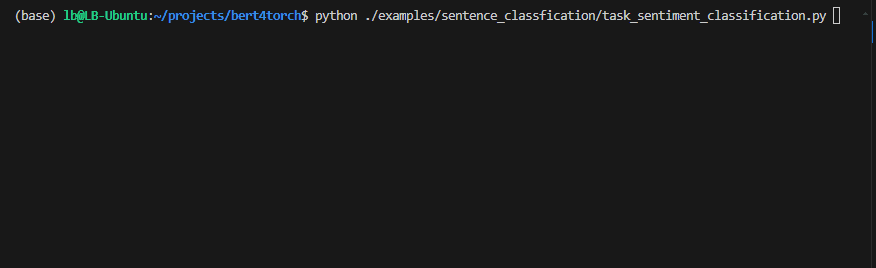
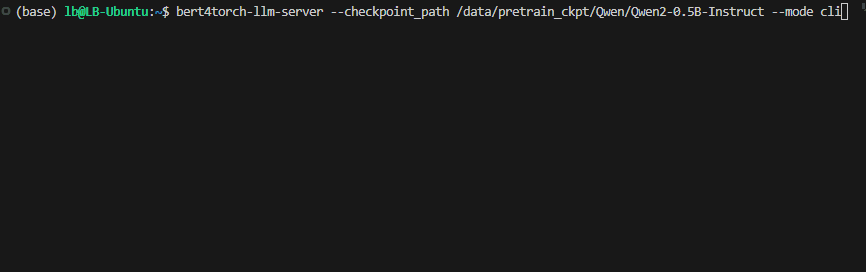

[](https://github.com/Tongjilibo/bert4torch/blob/master/LICENSE)
[](https://github.com/Tongjilibo/bert4torch/releases)
[](https://pypi.org/project/bert4torch/)
[](https://pypistats.org/packages/bert4torch)
[](https://github.com/Tongjilibo/bert4torch)
[](https://github.com/Tongjilibo/bert4torch/issues)
[](https://github.com/Tongjilibo/bert4torch/issues)
[](https://github.com/Tongjilibo/bert4torch/blob/master/docs/pics/wechat_group.jpg)

[Documentation](https://bert4torch.readthedocs.io) |
[Torch4keras](https://github.com/Tongjilibo/torch4keras) |
[Examples](https://github.com/Tongjilibo/bert4torch/blob/master/examples) |
[build_MiniLLM_from_scratch](https://github.com/Tongjilibo/build_MiniLLM_from_scratch) |
[bert4vector](https://github.com/Tongjilibo/bert4vector)


## 目录
- [目录](#目录)
- [1. 下载安装](#1-下载安装)
- [2. 功能](#2-功能)
- [3. 快速上手](#3-快速上手)
  - [3.1 上手教程](#31-上手教程)
  - [3.2 命令行快速部署大模型服务](#32-命令行快速部署大模型服务)
- [4. 版本和更新历史](#4-版本和更新历史)
  - [4.1 版本历史](#41-版本历史)
  - [4.2 更新历史](#42-更新历史)
- [5. 预训练权重](#5-预训练权重)
- [6. 鸣谢](#6-鸣谢)
- [7. 引用](#7-引用)
- [8. 其他](#8-其他)
  

## 1. 下载安装

安装稳定版

```shell
pip install bert4torch
```

安装最新版

```shell
pip install git+https://github.com/Tongjilibo/bert4torch
```

- **注意事项**：pip包的发布慢于git上的开发版本，git clone**注意引用路径**，注意权重是否需要转换
- **测试用例**：`git clone https://github.com/Tongjilibo/bert4torch`，修改example中的预训练模型文件路径和数据路径即可启动脚本
- **自行训练**：针对自己的数据，修改相应的数据处理代码块
- **开发环境**：原使用`torch==1.10`版本进行开发，现已切换到`torch2.0`开发，如其他版本遇到不适配，欢迎反馈

## 2. 功能
- **LLM模型**: 加载chatglm、llama、 baichuan、ziya、bloom等开源大模型权重进行推理和微调，命令行一行部署大模型
- **核心功能**：加载bert、roberta、albert、xlnet、nezha、bart、RoFormer、RoFormer_V2、ELECTRA、GPT、GPT2、T5、GAU-alpha、ERNIE等预训练权重继续进行finetune、并支持在bert基础上灵活定义自己模型
- [**丰富示例**](https://github.com/Tongjilibo/bert4torch/blob/master/examples/)：包含[llm](https://github.com/Tongjilibo/bert4torch/blob/master/examples/llm)、[pretrain](https://github.com/Tongjilibo/bert4torch/blob/master/examples/pretrain)、[sentence_classfication](https://github.com/Tongjilibo/bert4torch/blob/master/examples/sentence_classfication)、[sentence_embedding](https://github.com/Tongjilibo/bert4torch/tree/master/examples/sentence_embedding)、[sequence_labeling](https://github.com/Tongjilibo/bert4torch/blob/master/examples/sequence_labeling)、[relation_extraction](https://github.com/Tongjilibo/bert4torch/blob/master/examples/relation_extraction)、[seq2seq](https://github.com/Tongjilibo/bert4torch/blob/master/examples/seq2seq)、[serving](https://github.com/Tongjilibo/bert4torch/blob/master/examples/serving/)等多种解决方案
- **实验验证**：已在公开数据集实验验证，使用如下[examples数据集](https://github.com/Tongjilibo/bert4torch/blob/master/data/README.md)和[实验指标](https://github.com/Tongjilibo/bert4torch/blob/master/examples/Experiments.md)
- **易用trick**：集成了常见的[trick](https://github.com/Tongjilibo/bert4torch/blob/master/examples/training_trick)，即插即用
- **其他特性**：[加载transformers库模型](https://github.com/Tongjilibo/bert4torch/blob/master//tutorials/tutorials_load_transformers_model.py)一起使用；调用方式简洁高效；有训练进度条动态展示；配合torchinfo打印参数量；默认Logger和Tensorboard简便记录训练过程；自定义fit过程，满足高阶需求
- **训练过程**：

  

|          功能                | bert4torch |  transformers | 备注 |
|-----------------------------|------------|----------------|--------|
|训练进度条                     | ✅         |      ✅        |进度条打印loss和定义的metrics|
|分布式训练dp/ddp               | ✅         |      ✅        |torch自带dp/ddp|
|各类callbacks                 | ✅         |      ✅        |日志/tensorboard/earlystop/wandb等|
|大模型推理，stream/batch输出    | ✅         |      ✅        |各个模型是通用的，无需单独维护脚本|
|大模型微调                     | ✅         |      ✅        |lora依赖peft库，pv2自带|
|丰富tricks                    | ✅         |      ❌        |对抗训练等tricks即插即用|
|代码简洁易懂，自定义空间大        | ✅         |      ❌        |代码复用度高, keras代码训练风格|
|仓库的维护能力/影响力/使用量/兼容性| ❌         |      ✅        |目前仓库个人维护|
|一键部署大模型                   |

## 3. 快速上手

### 3.1 上手教程
- [Quick-Start](https://bert4torch.readthedocs.io/en/latest//Quick-Start.html)
- [快速上手教程](https://github.com/Tongjilibo/bert4torch/blob/master//tutorials/README.md)，[教程示例](https://github.com/Tongjilibo/bert4torch/blob/master//tutorials)，[实战示例](https://github.com/Tongjilibo/bert4torch/blob/master/examples)
- [bert4torch介绍(知乎)](https://zhuanlan.zhihu.com/p/486329434)，[bert4torch快速上手(知乎)](https://zhuanlan.zhihu.com/p/508890807)，[bert4torch又双叒叕更新啦(知乎)](https://zhuanlan.zhihu.com/p/560885427?)

### 3.2 命令行快速部署大模型服务
- 本地 / 联网加载
  ```shell
  # 联网下载全部文件
  bert4torch serve --checkpoint_path Qwen2-0.5B-Instruct

  # 加载本地大模型，联网下载bert4torch_config.json
  bert4torch serve --checkpoint_path /data/pretrain_ckpt/Qwen/Qwen2-0.5B-Instruct --config_path Qwen/Qwen2-0.5B-Instruct

  # 加载本地大模型，且bert4torch_config.json已经下载并放于同名目录下
  bert4torch serve --checkpoint_path /data/pretrain_ckpt/Qwen/Qwen2-0.5B-Instruct
  ```
- 命令行 / gradio网页 / openai_api
  ```shell
  # 命令行
  bert4torch serve --checkpoint_path /data/pretrain_ckpt/Qwen/Qwen2-0.5B-Instruct --mode cli

  # gradio网页
  bert4torch serve --checkpoint_path /data/pretrain_ckpt/Qwen/Qwen2-0.5B-Instruct --mode gradio

  # openai_api
  bert4torch serve --checkpoint_path /data/pretrain_ckpt/Qwen/Qwen2-0.5B-Instruct --mode openai
  ```
- 命令行聊天示例
  

## 4. 版本和更新历史
### 4.1 版本历史
|更新日期| bert4torch | torch4keras | 版本说明 |
|------| ---------------- | ----------------- |----------- |
|20250511| 0.5.7          | 0.2.9.post2 |命令行参数修改为`bert4torch serve`, 增加`Qwen3`|
|20250401| 0.5.6          | 0.2.9 |命令行支持图片输入, 修复rope在batch推理和超长时候的bug|
|20250215| 0.5.5          | 0.2.8 |增加`deepseek-r1`, `internvl`, `internlm3`, `glm4v`, `modernbert`, `mllama`, `qwen2vl`, `qwenvl`|
|20240928| 0.5.4          | 0.2.7 | 【新功能】增加`deepseek`、`MiniCPM`、`MiniCPMV`、`llama3.2`、`Qwen2.5`；支持device_map=auto;【修复】修复batch_generate和n>1的bug|
|20240814| 0.5.3          | 0.2.6 | 【新功能】增加`llama3.1/Yi1.5`；自动选择从hfmirror下载；支持命令行参数`bert4torch serve`|

[更多版本](https://github.com/Tongjilibo/bert4torch/blob/master/docs/Update.md)

### 4.2 更新历史

[更多历史](https://github.com/Tongjilibo/bert4torch/blob/master/docs/History.md)

## 5. 预训练权重
- 预训练模型支持多种代码加载方式
  ```python
  from bert4torch.models import build_transformer_model

  # 1. 仅指定config_path: 从头初始化模型结构, 不加载预训练模型
  model = build_transformer_model('./model/bert4torch_config.json')

  # 2. 仅指定checkpoint_path: 
  ## 2.1 文件夹路径: 自动寻找路径下的*.bin/*.safetensors权重文件 + 需把bert4torch_config.json下载并放于该目录下
  model = build_transformer_model(checkpoint_path='./model')

  ## 2.2 文件路径/列表: 文件路径即权重路径/列表, bert4torch_config.json会从同级目录下寻找
  model = build_transformer_model(checkpoint_path='./pytorch_model.bin')

  ## 2.3 model_name: hf上预训练权重名称, 会自动下载hf权重以及bert4torch_config.json文件
  model = build_transformer_model(checkpoint_path='bert-base-chinese')

  # 3. 同时指定config_path和checkpoint_path(本地路径名或model_name排列组合): 
  #    本地路径从本地加载，pretrained_model_name会联网下载
  config_path = './model/bert4torch_config.json'  # 或'bert-base-chinese'
  checkpoint_path = './model/pytorch_model.bin'  # 或'bert-base-chinese'
  model = build_transformer_model(config_path, checkpoint_path)
  ```

- 预训练权重链接和bert4torch_config.json

| 模型分类| 模型名称 | 权重来源| 权重链接/checkpoint_path | config_path|
| ----- | ----- | ----- | ----- | ----- |
| bert| bert-base-chinese| google-bert | [`google-bert/bert-base-chinese`](https://huggingface.co/google-bert/bert-base-chinese) | [`google-bert/bert-base-chinese`](https://huggingface.co/Tongjilibo/bert4torch_config/blob/main/google-bert/bert-base-chinese/bert4torch_config.json)|
|     | [chinese_L-12_H-768_A-12](https://github.com/google-research/bert) | 谷歌 | [tf权重](https://storage.googleapis.com/bert_models/2018_11_03/chinese_L-12_H-768_A-12.zip)<br>[`Tongjilibo/bert-chinese_L-12_H-768_A-12`](https://huggingface.co/Tongjilibo/bert-chinese_L-12_H-768_A-12) | |
|     | [chinese-bert-wwm-ext](https://github.com/ymcui/Chinese-BERT-wwm) | HFL | [`hfl/chinese-bert-wwm-ext`](https://huggingface.co/hfl/chinese-bert-wwm-ext)| [`hfl/chinese-bert-wwm-ext`](https://huggingface.co/Tongjilibo/bert4torch_config/blob/main/hfl/chinese-bert-wwm-ext/bert4torch_config.json) |
|     | bert-base-multilingual-cased| google-bert | [`google-bert/bert-base-multilingual-cased`](https://huggingface.co/google-bert/bert-base-multilingual-cased) | [`google-bert/bert-base-multilingual-cased`](https://huggingface.co/Tongjilibo/bert4torch_config/blob/main/google-bert/bert-base-multilingual-cased/bert4torch_config.json) |
|     | bert-base-cased| google-bert | [`google-bert/bert-base-cased`](https://huggingface.co/google-bert/bert-base-cased) | [`google-bert/bert-base-cased`](https://huggingface.co/Tongjilibo/bert4torch_config/blob/main/google-bert/bert-base-cased/bert4torch_config.json) |
|     | bert-base-uncased| google-bert | [`google-bert/bert-base-uncased`](https://huggingface.co/google-bert/bert-base-uncased) | [`google-bert/bert-base-uncased`](https://huggingface.co/Tongjilibo/bert4torch_config/blob/main/google-bert/bert-base-uncased/bert4torch_config.json) |
|     | [MacBERT](https://github.com/ymcui/MacBERT) | HFL| [`hfl/chinese-macbert-base`](https://huggingface.co/hfl/chinese-macbert-base)<br>[`hfl/chinese-macbert-large`](https://huggingface.co/hfl/chinese-macbert-large) |[`hfl/chinese-macbert-base`](https://huggingface.co/Tongjilibo/bert4torch_config/blob/main/hfl/chinese-macbert-base/bert4torch_config.json)<br>[`hfl/chinese-macbert-large`](https://huggingface.co/Tongjilibo/bert4torch_config/blob/main/hfl/chinese-macbert-large/bert4torch_config.json)|
|     | [WoBERT](https://github.com/ZhuiyiTechnology/WoBERT)| 追一科技|[`junnyu/wobert_chinese_base`](https://huggingface.co/junnyu/wobert_chinese_base)，[`junnyu/wobert_chinese_plus_base`](https://huggingface.co/junnyu/wobert_chinese_plus_base) |[`junnyu/wobert_chinese_base`](https://huggingface.co/Tongjilibo/bert4torch_config/blob/main/junnyu/wobert_chinese_base/bert4torch_config.json)<br>[`junnyu/wobert_chinese_plus_base`](https://huggingface.co/Tongjilibo/bert4torch_config/blob/main/junnyu/wobert_chinese_plus_base/bert4torch_config.json)|
|roberta|[chinese-roberta-wwm-ext](https://github.com/ymcui/Chinese-BERT-wwm) | HFL | [`hfl/chinese-roberta-wwm-ext`](https://huggingface.co/hfl/chinese-roberta-wwm-ext)<br>[`hfl/chinese-roberta-wwm-ext-large`](https://huggingface.co/hfl/chinese-roberta-wwm-ext-large)<br>(large的mlm权重是随机初始化) |[`hfl/chinese-roberta-wwm-ext`](https://huggingface.co/Tongjilibo/bert4torch_config/blob/main/hfl/chinese-roberta-wwm-ext/bert4torch_config.json)<br>[`hfl/chinese-roberta-wwm-ext-large`](https://huggingface.co/Tongjilibo/bert4torch_config/blob/main/hfl/chinese-roberta-wwm-ext-large/bert4torch_config.json) |
|     |[roberta-small/tiny](https://github.com/ZhuiyiTechnology/pretrained-models)| 追一科技| [`Tongjilibo/chinese_roberta_L-4_H-312_A-12`](https://huggingface.co/Tongjilibo/chinese_roberta_L-4_H-312_A-12)<br>[`Tongjilibo/chinese_roberta_L-6_H-384_A-12`](https://huggingface.co/Tongjilibo/chinese_roberta_L-6_H-384_A-12) | |
|     |[roberta-base](https://github.com/facebookresearch/fairseq/tree/main/examples/roberta)| FacebookAI | [`FacebookAI/roberta-base`](https://huggingface.co/FacebookAI/roberta-base) | [`FacebookAI/roberta-base`](https://huggingface.co/Tongjilibo/bert4torch_config/blob/main/FacebookAI/roberta-base/bert4torch_config.json) |
|     | [guwenbert](https://github.com/Ethan-yt/guwenbert) | ethanyt |[`ethanyt/guwenbert-base`](https://huggingface.co/ethanyt/guwenbert-base) | [`ethanyt/guwenbert-base`](https://huggingface.co/Tongjilibo/bert4torch_config/blob/main/ethanyt/guwenbert-base/bert4torch_config.json)|
| albert|[albert_zh](https://github.com/brightmart/albert_zh)<br>[albert_pytorch](https://github.com/lonePatient/albert_pytorch)| brightmart| [`voidful/albert_chinese_tiny`](https://huggingface.co/voidful/albert_chinese_tiny)<br>[`voidful/albert_chinese_small`](https://huggingface.co/voidful/albert_chinese_small)<br>[`voidful/albert_chinese_base`](https://huggingface.co/voidful/albert_chinese_base)<br>[`voidful/albert_chinese_large`](https://huggingface.co/voidful/albert_chinese_large)<br>[`voidful/albert_chinese_xlarge`](https://huggingface.co/voidful/albert_chinese_xlarge)<br>[`voidful/albert_chinese_xxlarge`](https://huggingface.co/voidful/albert_chinese_xxlarge) | [`voidful/albert_chinese_tiny`](https://huggingface.co/Tongjilibo/bert4torch_config/blob/main/voidful/albert_chinese_tiny/bert4torch_config.json)<br>[`voidful/albert_chinese_small`](https://huggingface.co/Tongjilibo/bert4torch_config/blob/main/voidful/albert_chinese_small/bert4torch_config.json)<br>[`voidful/albert_chinese_base`](https://huggingface.co/Tongjilibo/bert4torch_config/blob/main/voidful/albert_chinese_base/bert4torch_config.json)<br>[`voidful/albert_chinese_large`](https://huggingface.co/Tongjilibo/bert4torch_config/blob/main/voidful/albert_chinese_large/bert4torch_config.json)<br>[`voidful/albert_chinese_xlarge`](https://huggingface.co/Tongjilibo/bert4torch_config/blob/main/voidful/albert_chinese_xlarge/bert4torch_config.json)<br>[`voidful/albert_chinese_xxlarge`](https://huggingface.co/Tongjilibo/bert4torch_config/blob/main/voidful/albert_chinese_xxlarge/bert4torch_config.json)|
| nezha|[NEZHA](https://github.com/huawei-noah/Pretrained-Language-Model/tree/master/NEZHA-PyTorch)<br>[NeZha_Chinese_PyTorch](https://github.com/lonePatient/NeZha_Chinese_PyTorch) | huawei_noah| [`sijunhe/nezha-cn-base`](https://huggingface.co/sijunhe/nezha-cn-base)<br>[`sijunhe/nezha-cn-large`](https://huggingface.co/sijunhe/nezha-cn-large)<br>[`sijunhe/nezha-base-wwm`](https://huggingface.co/sijunhe/nezha-base-wwm)<br>[`sijunhe/nezha-large-wwm`](https://huggingface.co/sijunhe/nezha-large-wwm) | [`sijunhe/nezha-cn-base`](https://huggingface.co/Tongjilibo/bert4torch_config/blob/main/sijunhe/nezha-cn-base/bert4torch_config.json)<br>[`sijunhe/nezha-cn-large`](https://huggingface.co/Tongjilibo/bert4torch_config/blob/main/sijunhe/nezha-cn-large/bert4torch_config.json)<br>[`sijunhe/nezha-base-wwm`](https://huggingface.co/Tongjilibo/bert4torch_config/blob/main/sijunhe/nezha-base-wwm/bert4torch_config.json)<br>[`sijunhe/nezha-large-wwm`](https://huggingface.co/Tongjilibo/bert4torch_config/blob/main/sijunhe/nezha-large-wwm/bert4torch_config.json)|
|      |[nezha_gpt_dialog](https://github.com/bojone/nezha_gpt_dialog)| bojone| [`Tongjilibo/nezha_gpt_dialog`](https://huggingface.co/Tongjilibo/nezha_gpt_dialog) | |
| xlnet|[Chinese-XLNet](https://github.com/ymcui/Chinese-XLNet) | HFL | [`hfl/chinese-xlnet-base`](https://huggingface.co/hfl/chinese-xlnet-base) | [`hfl/chinese-xlnet-base`](https://huggingface.co/Tongjilibo/bert4torch_config/blob/main/hfl/chinese-xlnet-base/bert4torch_config.json)|
||[tranformer_xl](https://github.com/kimiyoung/transformer-xl)|huggingface|[`transfo-xl/transfo-xl-wt103`](https://huggingface.co/transfo-xl/transfo-xl-wt103)|[`transfo-xl/transfo-xl-wt103`](https://huggingface.co/Tongjilibo/bert4torch_config/blob/main/transfo-xl/transfo-xl-wt103/bert4torch_config.json)|
|deberta| [Erlangshen-DeBERTa-v2](https://github.com/IDEA-CCNL/Fengshenbang-LM) | IDEA | [`IDEA-CCNL/Erlangshen-DeBERTa-v2-97M-Chinese`](https://huggingface.co/IDEA-CCNL/Erlangshen-DeBERTa-v2-97M-Chinese)<br>[`IDEA-CCNL/Erlangshen-DeBERTa-v2-320M-Chinese`](https://huggingface.co/IDEA-CCNL/Erlangshen-DeBERTa-v2-320M-Chinese)<br>[`IDEA-CCNL/Erlangshen-DeBERTa-v2-710M-Chinese`](https://huggingface.co/IDEA-CCNL/Erlangshen-DeBERTa-v2-710M-Chinese) |[`IDEA-CCNL/Erlangshen-DeBERTa-v2-97M-Chinese`](https://huggingface.co/Tongjilibo/bert4torch_config/blob/main/IDEA-CCNL/Erlangshen-DeBERTa-v2-97M-Chinese/bert4torch_config.json)<br>[`IDEA-CCNL/Erlangshen-DeBERTa-v2-320M-Chinese`](https://huggingface.co/Tongjilibo/bert4torch_config/blob/main/IDEA-CCNL/Erlangshen-DeBERTa-v2-320M-Chinese/bert4torch_config.json)<br>[`IDEA-CCNL/Erlangshen-DeBERTa-v2-710M-Chinese`](https://huggingface.co/Tongjilibo/bert4torch_config/blob/main/IDEA-CCNL/Erlangshen-DeBERTa-v2-710M-Chinese/bert4torch_config.json) |
| electra|[Chinese-ELECTRA](https://github.com/ymcui/Chinese-ELECTRA) | HFL |[`hfl/chinese-electra-base-discriminator`](https://huggingface.co/hfl/chinese-electra-base-discriminator) |[`hfl/chinese-electra-base-discriminator`](https://huggingface.co/Tongjilibo/bert4torch_config/blob/main/hfl/chinese-electra-base-discriminator/bert4torch_config.json)|
| ernie|[ernie](https://github.com/PaddlePaddle/ERNIE) | 百度文心| [`nghuyong/ernie-1.0-base-zh`](https://huggingface.co/nghuyong/ernie-1.0-base-zh)<br>[`nghuyong/ernie-3.0-base-zh`](https://huggingface.co/nghuyong/ernie-3.0-base-zh)| [`nghuyong/ernie-1.0-base-zh`](https://huggingface.co/Tongjilibo/bert4torch_config/blob/main/nghuyong/ernie-1.0-base-zh/bert4torch_config.json)<br>[`nghuyong/ernie-3.0-base-zh`](https://huggingface.co/Tongjilibo/bert4torch_config/blob/main/nghuyong/ernie-3.0-base-zh/bert4torch_config.json)|
| roformer|[roformer](https://github.com/ZhuiyiTechnology/roformer)| 追一科技| [`junnyu/roformer_chinese_base`](https://huggingface.co/junnyu/roformer_chinese_base) |[`junnyu/roformer_chinese_base`](https://huggingface.co/Tongjilibo/bert4torch_config/blob/main/junnyu/roformer_chinese_base/bert4torch_config.json) |
|         |[roformer_v2](https://github.com/ZhuiyiTechnology/roformer-v2) | 追一科技| [`junnyu/roformer_v2_chinese_char_base`](https://huggingface.co/junnyu/roformer_v2_chinese_char_base)|[`junnyu/roformer_v2_chinese_char_base`](https://huggingface.co/Tongjilibo/bert4torch_config/blob/main/junnyu/roformer_v2_chinese_char_base/bert4torch_config.json) |
| simbert|[simbert](https://github.com/ZhuiyiTechnology/simbert) | 追一科技|[`Tongjilibo/simbert-chinese-base`](https://huggingface.co/Tongjilibo/simbert-chinese-base)<br>[`Tongjilibo/simbert-chinese-small`](https://huggingface.co/Tongjilibo/simbert-chinese-small)<br>[`Tongjilibo/simbert-chinese-tiny`](https://huggingface.co/Tongjilibo/simbert-chinese-tiny) | |
|        |[simbert_v2/roformer-sim](https://github.com/ZhuiyiTechnology/roformer-sim) | 追一科技|[`junnyu/roformer_chinese_sim_char_base`](https://huggingface.co/junnyu/roformer_chinese_sim_char_base)<br>[`junnyu/roformer_chinese_sim_char_ft_base`](https://huggingface.co/junnyu/roformer_chinese_sim_char_ft_base)<br>[`junnyu/roformer_chinese_sim_char_small`](https://huggingface.co/junnyu/roformer_chinese_sim_char_small)<br>[`junnyu/roformer_chinese_sim_char_ft_small`](https://huggingface.co/junnyu/roformer_chinese_sim_char_ft_small) | [`junnyu/roformer_chinese_sim_char_base`](https://huggingface.co/Tongjilibo/bert4torch_config/blob/main/junnyu/roformer_chinese_sim_char_base/bert4torch_config.json)<br>[`junnyu/roformer_chinese_sim_char_ft_base`](https://huggingface.co/Tongjilibo/bert4torch_config/blob/main/junnyu/roformer_chinese_sim_char_ft_base/bert4torch_config.json)<br>[`junnyu/roformer_chinese_sim_char_small`](https://huggingface.co/Tongjilibo/bert4torch_config/blob/main/junnyu/roformer_chinese_sim_char_small/bert4torch_config.json)<br>[`junnyu/roformer_chinese_sim_char_ft_small`](https://huggingface.co/Tongjilibo/bert4torch_config/blob/main/junnyu/roformer_chinese_sim_char_ft_small/bert4torch_config.json) |
| gau|[GAU-alpha](https://github.com/ZhuiyiTechnology/GAU-alpha) | 追一科技| [`Tongjilibo/chinese_GAU-alpha-char_L-24_H-768`](https://huggingface.co/Tongjilibo/chinese_GAU-alpha-char_L-24_H-768) | |
|ModernBERT|[ModernBERT](https://huggingface.co/collections/answerdotai/modernbert-67627ad707a4acbf33c41deb)|answerdotai|[`answerdotai/ModernBERT-base`](https://huggingface.co/answerdotai/ModernBERT-base)<br>[`answerdotai/ModernBERT-large`](https://huggingface.co/answerdotai/ModernBERT-large)| [`answerdotai/ModernBERT-base`](https://huggingface.co/Tongjilibo/bert4torch_config/blob/main/answerdotai/ModernBERT-base/bert4torch_config.json)<br>[`answerdotai/ModernBERT-large`](https://huggingface.co/Tongjilibo/bert4torch_config/blob/main/answerdotai/ModernBERT-large/bert4torch_config.json) |
| uie| [uie](https://github.com/universal-ie/UIE)<br>[uie_pytorch](https://github.com/HUSTAI/uie_pytorch) | 百度| [`Tongjilibo/uie-base`](https://huggingface.co/Tongjilibo/uie-base) | |
| gpt |[CDial-GPT](https://github.com/thu-coai/CDial-GPT)| thu-coai| [`thu-coai/CDial-GPT_LCCC-base`](https://huggingface.co/thu-coai/CDial-GPT_LCCC-base)<br>[`thu-coai/CDial-GPT_LCCC-large`](https://huggingface.co/thu-coai/CDial-GPT_LCCC-large) | [`thu-coai/CDial-GPT_LCCC-base`](https://huggingface.co/Tongjilibo/bert4torch_config/blob/main/thu-coai/CDial-GPT_LCCC-base/bert4torch_config.json)<br>[`thu-coai/CDial-GPT_LCCC-large`](https://huggingface.co/Tongjilibo/bert4torch_config/blob/main/thu-coai/CDial-GPT_LCCC-large/bert4torch_config.json) |
|     | [cmp_lm(26亿)](https://github.com/TsinghuaAI/CPM-1-Generate)|清华 | [`TsinghuaAI/CPM-Generate`](https://huggingface.co/TsinghuaAI/CPM-Generate) | [`	TsinghuaAI/CPM-Generate`](https://huggingface.co/Tongjilibo/bert4torch_config/blob/main/TsinghuaAI/CPM-Generate/bert4torch_config.json) |
|     |[nezha_gen](https://github.com/huawei-noah/Pretrained-Language-Model/tree/master/NEZHA-Gen-TensorFlow)|huawei_noah|[`Tongjilibo/chinese_nezha_gpt_L-12_H-768_A-12`](https://huggingface.co/Tongjilibo/chinese_nezha_gpt_L-12_H-768_A-12)|
|     | [gpt2-chinese-cluecorpussmall](https://github.com/dbiir/UER-py/wiki/Modelzoo) |UER | [`uer/gpt2-chinese-cluecorpussmall`](https://huggingface.co/uer/gpt2-chinese-cluecorpussmall) | [`uer/gpt2-chinese-cluecorpussmall`](https://huggingface.co/Tongjilibo/bert4torch_config/blob/main/uer/gpt2-chinese-cluecorpussmall/bert4torch_config.json)|
|     | [gpt2-ml](https://github.com/imcaspar/gpt2-ml) |imcaspar | [torch](https://github.com/ghosthamlet/gpt2-ml-torch)<br>[BaiduYun(84dh)](https://pan.baidu.com/s/16tL4Bmoh6jPy0cOND0YyeA) | [`gpt2-ml_15g_corpus`](https://huggingface.co/Tongjilibo/bert4torch_config/blob/main/gpt2-ml_15g_corpus/bert4torch_config.json)<br>[`gpt2-ml_30g_corpus`](https://huggingface.co/Tongjilibo/bert4torch_config/blob/main/gpt2-ml_30g_corpus/bert4torch_config.json) |
| bart| [bart_base_chinese](https://github.com/fastnlp/CPT) |复旦fnlp| [`fnlp/bart-base-chinese`](https://huggingface.co/fnlp/bart-base-chinese)<br>[v1.0](https://huggingface.co/fnlp/bart-base-chinese/tree/v1.0)| [`fnlp/bart-base-chinese`](https://huggingface.co/Tongjilibo/bert4torch_config/blob/main/fnlp/bart-base-chinese/bert4torch_config.json)<br>[`fnlp/bart-base-chinese-v1.0`](https://huggingface.co/Tongjilibo/bert4torch_config/blob/main/fnlp/bart-base-chinese-v1.0/bert4torch_config.json) |
| t5  | [t5](https://github.com/dbiir/UER-py/wiki/Modelzoo) | UER | [`uer/t5-small-chinese-cluecorpussmall`](https://huggingface.co/uer/t5-small-chinese-cluecorpussmall)<br>[`uer/t5-base-chinese-cluecorpussmall`](https://huggingface.co/uer/t5-base-chinese-cluecorpussmall) | [`uer/t5-base-chinese-cluecorpussmall`](https://huggingface.co/Tongjilibo/bert4torch_config/blob/main/uer/t5-base-chinese-cluecorpussmall/bert4torch_config.json)<br>[`uer/t5-small-chinese-cluecorpussmall`](https://huggingface.co/Tongjilibo/bert4torch_config/blob/main/uer/t5-small-chinese-cluecorpussmall/bert4torch_config.json)|
|     | mt5 | 谷歌| [`google/mt5-base`](https://huggingface.co/google/mt5-base)| [`google/mt5-base`](https://huggingface.co/Tongjilibo/bert4torch_config/blob/main/google/mt5-base/bert4torch_config.json)|
|     | [t5_pegasus](https://github.com/ZhuiyiTechnology/t5-pegasus)| 追一科技| [`Tongjilibo/chinese_t5_pegasus_small`](https://huggingface.co/Tongjilibo/chinese_t5_pegasus_small)<br>[`Tongjilibo/chinese_t5_pegasus_base`](https://huggingface.co/Tongjilibo/chinese_t5_pegasus_base)| |
|     | [chatyuan](https://github.com/clue-ai/ChatYuan)| clue-ai |[`ClueAI/ChatYuan-large-v1`](https://huggingface.co/ClueAI/ChatYuan-large-v1)<br>[`ClueAI/ChatYuan-large-v2`](https://huggingface.co/ClueAI/ChatYuan-large-v2)| [`ClueAI/ChatYuan-large-v1`](https://huggingface.co/Tongjilibo/bert4torch_config/blob/main/ClueAI/ChatYuan-large-v1/bert4torch_config.json)<br>[`ClueAI/ChatYuan-large-v2`](https://huggingface.co/Tongjilibo/bert4torch_config/blob/main/ClueAI/ChatYuan-large-v2/bert4torch_config.json)|
|     | [PromptCLUE](https://github.com/clue-ai/PromptCLUE)| clue-ai | [`ClueAI/PromptCLUE-base`](https://huggingface.co/ClueAI/PromptCLUE-base) | [`ClueAI/PromptCLUE-base`](https://huggingface.co/Tongjilibo/bert4torch_config/blob/main/ClueAI/PromptCLUE-base/bert4torch_config.json)|
| chatglm   | [chatglm-6b](https://github.com/THUDM/ChatGLM-6B) | THUDM | [`THUDM/chatglm-6b`](https://huggingface.co/THUDM/chatglm-6b)<br>[`THUDM/chatglm-6b-int8`](https://huggingface.co/THUDM/chatglm-6b-int8)<br>[`THUDM/chatglm-6b-int4`](https://huggingface.co/THUDM/chatglm-6b-int4)<br>[v0.1.0](https://huggingface.co/THUDM/chatglm-6b/tree/v0.1.0) | [`THUDM/chatglm-6b`](https://huggingface.co/Tongjilibo/bert4torch_config/blob/main/THUDM/chatglm-6b/bert4torch_config.json)<br>[`THUDM/chatglm-6b-int8`](https://huggingface.co/Tongjilibo/bert4torch_config/blob/main/THUDM/chatglm-6b-int8/bert4torch_config.json)<br>[`THUDM/chatglm-6b-int4`](https://huggingface.co/Tongjilibo/bert4torch_config/blob/main/THUDM/chatglm-6b-int4/bert4torch_config.json)<br>[`THUDM/chatglm-6b-v0.1.0`](https://huggingface.co/Tongjilibo/bert4torch_config/blob/main/THUDM/chatglm-6b-v0.1.0/bert4torch_config.json) |
|       |[chatglm2-6b](https://github.com/THUDM/ChatGLM2-6B) | THUDM | [`THUDM/chatglm2-6b`](https://huggingface.co/THUDM/chatglm2-6b)<br>[`THUDM/chatglm2-6b-int4`](https://huggingface.co/THUDM/chatglm2-6b-int4)<br>[`THUDM/chatglm2-6b-32k`](https://huggingface.co/THUDM/chatglm2-6b-32k) | [`THUDM/chatglm2-6b`](https://huggingface.co/Tongjilibo/bert4torch_config/blob/main/THUDM/chatglm2-6b/bert4torch_config.json)<br>[`THUDM/chatglm2-6b-int4`](https://huggingface.co/Tongjilibo/bert4torch_config/blob/main/THUDM/chatglm2-6b-int4/bert4torch_config.json)<br>[`THUDM/chatglm2-6b-32k`](https://huggingface.co/Tongjilibo/bert4torch_config/blob/main/THUDM/chatglm2-6b-32k/bert4torch_config.json) |
|       |[chatglm3-6b](https://github.com/THUDM/ChatGLM3) | THUDM | [`THUDM/chatglm3-6b`](https://huggingface.co/THUDM/chatglm3-6b)<br>[`THUDM/chatglm3-6b-32k`](https://huggingface.co/THUDM/chatglm3-6b-32k) | [`THUDM/chatglm3-6b`](https://huggingface.co/Tongjilibo/bert4torch_config/blob/main/THUDM/chatglm3-6b/bert4torch_config.json)<br>[`THUDM/chatglm3-6b-32k`](https://huggingface.co/Tongjilibo/bert4torch_config/blob/main/THUDM/chatglm3-6b-32k/bert4torch_config.json) |
|       |[glm4-9b](https://github.com/THUDM/GLM-4) | THUDM | [`THUDM/glm-4-9b`](https://huggingface.co/THUDM/glm-4-9b)<br>[`THUDM/glm-4-9b-chat`](https://huggingface.co/THUDM/glm-4-9b-chat)<br>[`THUDM/glm-4-9b-chat-1m`](https://huggingface.co/THUDM/glm-4-9b-chat-1m) | [`THUDM/glm-4-9b`](https://huggingface.co/Tongjilibo/bert4torch_config/blob/main/THUDM/glm-4-9b/bert4torch_config.json)<br>[`THUDM/glm-4-9b-chat`](https://huggingface.co/Tongjilibo/bert4torch_config/blob/main/THUDM/glm-4-9b-chat/bert4torch_config.json)<br>[`THUDM/glm-4-9b-chat-1m`](https://huggingface.co/Tongjilibo/bert4torch_config/blob/main/THUDM/glm-4-9b-chat-1m/bert4torch_config.json)|
|       |[glm4v-9b](https://github.com/THUDM/GLM-4) | THUDM | [`THUDM/glm-4v-9b`](https://huggingface.co/THUDM/glm-4v-9b) | [`THUDM/glm-4v-9b`](https://huggingface.co/Tongjilibo/bert4torch_config/blob/main/THUDM/glm-4v-9b/bert4torch_config.json) |
| llama | [llama](https://github.com/facebookresearch/llama) | meta|  | [`meta-llama/llama-7b`](https://huggingface.co/Tongjilibo/bert4torch_config/blob/main/meta-llama/llama-7b/bert4torch_config.json)<br>[`meta-llama/llama-13b`](https://huggingface.co/Tongjilibo/bert4torch_config/blob/main/meta-llama/llama-13b/bert4torch_config.json)|
|       | [llama-2](https://github.com/facebookresearch/llama) | meta| [meta-llama/Llama-2-7b-hf](https://huggingface.co/meta-llama/Llama-2-7b-hf)<br>[meta-llama/Llama-2-7b-chat-hf](https://huggingface.co/meta-llama/Llama-2-7b-chat-hf)<br>[meta-llama/Llama-2-13b-hf](https://huggingface.co/meta-llama/Llama-2-13b-hf)<br>[meta-llama/Llama-2-13b-chat-hf](https://huggingface.co/meta-llama/Llama-2-13b-chat-hf) | [`meta-llama/Llama-2-7b-hf`](https://huggingface.co/Tongjilibo/bert4torch_config/blob/main/meta-llama/Llama-2-7b-hf/bert4torch_config.json)<br>[`meta-llama/Llama-2-7b-chat-hf`](https://huggingface.co/Tongjilibo/bert4torch_config/blob/main/meta-llama/Llama-2-7b-chat-hf/bert4torch_config.json)<br>[`meta-llama/Llama-2-13b-hf`](https://huggingface.co/Tongjilibo/bert4torch_config/blob/main/meta-llama/Llama-2-13b-hf/bert4torch_config.json)<br>[`meta-llama/Llama-2-13b-chat-hf`](https://huggingface.co/Tongjilibo/bert4torch_config/blob/main/meta-llama/Llama-2-13b-chat-hf/bert4torch_config.json)|
|       | [llama-3](https://github.com/meta-llama/llama3) | meta| [`meta-llama/Meta-Llama-3-8B`](https://huggingface.co/meta-llama/Meta-Llama-3-8B)<br>[`meta-llama/Meta-Llama-3-8B-Instruct`](https://huggingface.co/meta-llama/Meta-Llama-3-8B-Instruct) | [`meta-llama/Meta-Llama-3-8B`](https://huggingface.co/Tongjilibo/bert4torch_config/blob/main/meta-llama/Meta-Llama-3-8B/bert4torch_config.json)<br>[`meta-llama/Meta-Llama-3-8B-Instruct`](https://huggingface.co/Tongjilibo/bert4torch_config/blob/main/meta-llama/Meta-Llama-3-8B-Instruct/bert4torch_config.json)|
|       | [llama-3.1](https://github.com/meta-llama/llama-models) | meta | [`meta-llama/Meta-Llama-3.1-8B`](https://huggingface.co/meta-llama/Meta-Llama-3.1-8B)<br>[`meta-llama/Meta-Llama-3.1-8B-Instruct`](https://huggingface.co/meta-llama/Meta-Llama-3.1-8B-Instruct) | [`meta-llama/Meta-Llama-3.1-8B`](https://huggingface.co/Tongjilibo/bert4torch_config/blob/main/meta-llama/Meta-Llama-3.1-8B/bert4torch_config.json)<br>[`meta-llama/Meta-Llama-3.1-8B-Instruct`](https://huggingface.co/Tongjilibo/bert4torch_config/blob/main/meta-llama/Meta-Llama-3.1-8B-Instruct/bert4torch_config.json) |
|       | [llama-3.2](https://github.com/meta-llama/llama-models) | meta | [`meta-llama/Llama-3.2-1B`](https://huggingface.co/meta-llama/Llama-3.2-1B)<br>[`meta-llama/Llama-3.2-1B-Instruct`](https://huggingface.co/meta-llama/Llama-3.2-1B-Instruct)<br>[`meta-llama/Llama-3.2-3B`](https://huggingface.co/meta-llama/Llama-3.2-3B)<br>[`meta-llama/Llama-3.2-3B-Instruct`](https://huggingface.co/meta-llama/Llama-3.2-3B-Instruct) | [`meta-llama/Llama-3.2-1B`](https://huggingface.co/Tongjilibo/bert4torch_config/blob/main/meta-llama/Llama-3.2-1B/bert4torch_config.json)<br>[`meta-llama/Llama-3.2-1B-Instruct`](https://huggingface.co/Tongjilibo/bert4torch_config/blob/main/meta-llama/Llama-3.2-1B-Instruct/bert4torch_config.json)<br>[`meta-llama/Llama-3.2-3B`](https://huggingface.co/Tongjilibo/bert4torch_config/blob/main/meta-llama/Llama-3.2-3B/bert4torch_config.json)<br>[`meta-llama/Llama-3.2-3B-Instruct`](https://huggingface.co/Tongjilibo/bert4torch_config/blob/main/meta-llama/Llama-3.2-3B-Instruct/bert4torch_config.json) |
|       | [llama-3.2-vision](https://github.com/meta-llama/llama-models) | meta | [`meta-llama/Llama-3.2-11B-Vision`](https://huggingface.co/meta-llama/Llama-3.2-11B-Vision)<br>[`meta-llama/Llama-3.2-11B-Vision-Instruct`](https://huggingface.co/meta-llama/Llama-3.2-11B-Vision-Instruct) | [`meta-llama/Llama-3.2-11B-Vision`](https://huggingface.co/Tongjilibo/bert4torch_config/blob/main/meta-llama/Llama-3.2-11B-Vision/bert4torch_config.json)<br>[`meta-llama/Llama-3.2-11B-Vision-Instruct`](https://huggingface.co/Tongjilibo/bert4torch_config/blob/main/meta-llama/Llama-3.2-11B-Vision-Instruct/bert4torch_config.json) |
|llama-series| [Chinese-LLaMA-Alpaca](https://github.com/ymcui/Chinese-LLaMA-Alpaca)|HFL| [`hfl/chinese-alpaca-plus-lora-7b`](https://huggingface.co/hfl/chinese-alpaca-plus-lora-7b)<br>[`hfl/chinese-llama-plus-lora-7b`](https://huggingface.co/hfl/chinese-llama-plus-lora-7b)<br>(使用前需要合并lora权重) |[`hfl/chinese-alpaca-plus-7b`](https://huggingface.co/Tongjilibo/bert4torch_config/blob/main/hfl/chinese-alpaca-plus-7b/bert4torch_config.json)<br>[`hfl/chinese-llama-plus-7b`](https://huggingface.co/Tongjilibo/bert4torch_config/blob/main/hfl/chinese-llama-plus-7b/bert4torch_config.json)|
|       | [Chinese-LLaMA-Alpaca-2](https://github.com/ymcui/Chinese-LLaMA-Alpaca-2)|HFL| |待添加|
|       | [Chinese-LLaMA-Alpaca-3](https://github.com/ymcui/Chinese-LLaMA-Alpaca-3)|HFL| |待添加|
|       | [Belle_llama](https://github.com/LianjiaTech/BELLE)| LianjiaTech|[BelleGroup/BELLE-LLaMA-7B-2M-enc](https://huggingface.co/BelleGroup/BELLE-LLaMA-7B-2M-enc) | [合成说明](https://github.com/LianjiaTech/BELLE/tree/main/models)、[`BelleGroup/BELLE-LLaMA-7B-2M-enc`](https://huggingface.co/Tongjilibo/bert4torch_config/blob/main/BelleGroup/BELLE-LLaMA-7B-2M-enc)|
|       | [Ziya](https://github.com/IDEA-CCNL/Fengshenbang-LM) | IDEA-CCNL | [IDEA-CCNL/Ziya-LLaMA-13B-v1](https://huggingface.co/IDEA-CCNL/Ziya-LLaMA-13B-v1)<br>[IDEA-CCNL/Ziya-LLaMA-13B-v1.1](https://huggingface.co/IDEA-CCNL/Ziya-LLaMA-13B-v1.1)<br>[IDEA-CCNL/Ziya-LLaMA-13B-Pretrain-v1](https://huggingface.co/IDEA-CCNL/Ziya-LLaMA-13B-Pretrain-v1) | [`IDEA-CCNL/Ziya-LLaMA-13B-v1`](https://huggingface.co/Tongjilibo/bert4torch_config/blob/main/IDEA-CCNL/Ziya-LLaMA-13B-v1/bert4torch_config.json)<br>[`IDEA-CCNL/Ziya-LLaMA-13B-v1.1`](https://huggingface.co/Tongjilibo/bert4torch_config/blob/main/IDEA-CCNL/Ziya-LLaMA-13B-v1.1/bert4torch_config.json) |
|       | [vicuna](https://github.com/lm-sys/FastChat) | lmsys| [`lmsys/vicuna-7b-v1.5`](https://huggingface.co/lmsys/vicuna-7b-v1.5) | [`lmsys/vicuna-7b-v1.5`](https://huggingface.co/Tongjilibo/bert4torch_config/blob/main/lmsys/vicuna-7b-v1.5/bert4torch_config.json)|
|Baichuan| [Baichuan](https://github.com/baichuan-inc/Baichuan) | baichuan-inc | [`baichuan-inc/Baichuan-7B`](https://huggingface.co/baichuan-inc/Baichuan-7B)<br>[`baichuan-inc/Baichuan-13B-Base`](https://huggingface.co/baichuan-inc/Baichuan-13B-Base)<br>[`baichuan-inc/Baichuan-13B-Chat`](https://huggingface.co/baichuan-inc/Baichuan-13B-Chat) | [`baichuan-inc/Baichuan-7B`](https://huggingface.co/Tongjilibo/bert4torch_config/blob/main/baichuan-inc/Baichuan-7B/bert4torch_config.json)<br>[`baichuan-inc/Baichuan-13B-Base`](https://huggingface.co/Tongjilibo/bert4torch_config/blob/main/baichuan-inc/Baichuan-13B-Base/bert4torch_config.json)<br>[`baichuan-inc/Baichuan-13B-Chat`](https://huggingface.co/Tongjilibo/bert4torch_config/blob/main/baichuan-inc/Baichuan-13B-Chat/bert4torch_config.json) |
|       | [Baichuan2](https://github.com/baichuan-inc/Baichuan2) | baichuan-inc | [`baichuan-inc/Baichuan2-7B-Base`](https://huggingface.co/baichuan-inc/Baichuan2-7B-Base)<br>[`baichuan-inc/Baichuan2-7B-Chat`](https://huggingface.co/baichuan-inc/Baichuan2-7B-Chat)<br>[`baichuan-inc/Baichuan2-13B-Base`](https://huggingface.co/baichuan-inc/Baichuan2-13B-Base)<br>[`baichuan-inc/Baichuan2-13B-Chat`](https://huggingface.co/baichuan-inc/Baichuan2-13B-Chat) | [`baichuan-inc/Baichuan2-7B-Base`](https://huggingface.co/Tongjilibo/bert4torch_config/blob/main/baichuan-inc/Baichuan2-7B-Base/bert4torch_config.json)<br>[`baichuan-inc/Baichuan2-7B-Chat`](https://huggingface.co/Tongjilibo/bert4torch_config/blob/main/baichuan-inc/Baichuan2-7B-Chat/bert4torch_config.json)<br>[`baichuan-inc/Baichuan2-13B-Base`](https://huggingface.co/Tongjilibo/bert4torch_config/blob/main/baichuan-inc/Baichuan2-13B-Base/bert4torch_config.json)<br>[`baichuan-inc/Baichuan2-13B-Chat`](https://huggingface.co/Tongjilibo/bert4torch_config/blob/main/baichuan-inc/Baichuan2-13B-Chat/bert4torch_config.json) |
|  Yi  | [Yi](https://github.com/01-ai/Yi) | 01-ai| [`01-ai/Yi-6B`](https://huggingface.co/01-ai/Yi-6B)<br>[`01-ai/Yi-6B-200K`](https://huggingface.co/01-ai/Yi-6B-200K)<br>[`01-ai/Yi-9B`](https://huggingface.co/01-ai/Yi-9B)<br>[`01-ai/Yi-9B-200K`](https://huggingface.co/01-ai/Yi-9B-200K) | [`01-ai/Yi-6B`](https://huggingface.co/Tongjilibo/bert4torch_config/blob/main/01-ai/Yi-6B/bert4torch_config.json)<br>[`01-ai/Yi-6B-200K`](https://huggingface.co/Tongjilibo/bert4torch_config/blob/main/01-ai/Yi-6B-200K/bert4torch_config.json)<br>[`01-ai/Yi-9B`](https://huggingface.co/Tongjilibo/bert4torch_config/blob/main/01-ai/Yi-9B/bert4torch_config.json)<br>[`01-ai/Yi-9B-200K`](https://huggingface.co/Tongjilibo/bert4torch_config/blob/main/01-ai/Yi-9B-200K/bert4torch_config.json) |
|       | [Yi-1.5](https://github.com/01-ai/Yi-1.5) | 01-ai| [`01-ai/Yi-1.5-6B`](https://huggingface.co/01-ai/Yi-1.5-6B)<br>[`01-ai/Yi-1.5-6B-Chat`](https://huggingface.co/01-ai/Yi-1.5-6B-Chat)<br>[`01-ai/Yi-1.5-9B`](https://huggingface.co/01-ai/Yi-1.5-9B)<br>[`01-ai/Yi-1.5-9B-32K`](https://huggingface.co/01-ai/Yi-1.5-9B-32K)<br>[`01-ai/Yi-1.5-9B-Chat`](https://huggingface.co/01-ai/Yi-1.5-9B-Chat)<br>[`01-ai/Yi-1.5-9B-Chat-16K`](https://huggingface.co/01-ai/Yi-1.5-9B-Chat-16K) | [`01-ai/Yi-1.5-6B`](https://huggingface.co/Tongjilibo/bert4torch_config/blob/main/01-ai/Yi-1.5-6B/bert4torch_config.json)<br>[`01-ai/Yi-1.5-6B-Chat`](https://huggingface.co/Tongjilibo/bert4torch_config/blob/main/01-ai/Yi-1.5-6B-Chat/bert4torch_config.json)<br>[`01-ai/Yi-1.5-9B`](https://huggingface.co/Tongjilibo/bert4torch_config/blob/main/01-ai/Yi-1.5-9B/bert4torch_config.json)<br>[`01-ai/Yi-1.5-9B-32K`](https://huggingface.co/Tongjilibo/bert4torch_config/blob/main/01-ai/Yi-1.5-9B-32K/bert4torch_config.json)<br>[`01-ai/Yi-1.5-9B-Chat`](https://huggingface.co/Tongjilibo/bert4torch_config/blob/main/01-ai/Yi-1.5-9B-Chat)<br>[`01-ai/Yi-1.5-9B-Chat-16K`](https://huggingface.co/Tongjilibo/bert4torch_config/blob/main/01-ai/Yi-1.5-9B-Chat-16K/bert4torch_config.json) |
| bloom |[bloom](https://github.com/bigscience-workshop/xmtf) | bigscience | [`bigscience/bloom-560m`](https://huggingface.co/bigscience/bloom-560m)<br>[`bigscience/bloomz-560m`](https://huggingface.co/bigscience/bloomz-560m) | [`bigscience/bloom-560m`](https://huggingface.co/Tongjilibo/bert4torch_config/blob/main/bigscience/bloom-560m/bert4torch_config.json)<br>[`bigscience/bloomz-560m`](https://huggingface.co/Tongjilibo/bert4torch_config/blob/main/bigscience/bloomz-560m/bert4torch_config.json) |
| Qwen  |[Qwen](https://github.com/QwenLM/Qwen) | 阿里云 | [`Qwen/Qwen-1_8B`](https://huggingface.co/Qwen/Qwen-1_8B)<br>[`Qwen/Qwen-1_8B-Chat`](https://huggingface.co/Qwen/Qwen-1_8B-Chat)<br>[`Qwen/Qwen-7B`](https://huggingface.co/Qwen/Qwen-7B)<br>[`Qwen/Qwen-7B-Chat`](https://huggingface.co/Qwen/Qwen-7B-Chat)<br>[`Qwen/Qwen-14B`](https://huggingface.co/Qwen/Qwen-14B)<br>[`Qwen/Qwen-14B-Chat`](https://huggingface.co/Qwen/Qwen-14B-Chat) | [`Qwen/Qwen-1_8B`](https://huggingface.co/Tongjilibo/bert4torch_config/blob/main/Qwen/Qwen-1_8B/bert4torch_config.json)<br>[`Qwen/Qwen-1_8B-Chat`](https://huggingface.co/Tongjilibo/bert4torch_config/blob/main/Qwen/Qwen-1_8B-Chat/bert4torch_config.json)<br>[`Qwen/Qwen-7B`](https://huggingface.co/Tongjilibo/bert4torch_config/blob/main/Qwen/Qwen-7B/bert4torch_config.json)<br>[`Qwen/Qwen-7B-Chat`](https://huggingface.co/Tongjilibo/bert4torch_config/blob/main/Qwen/Qwen-7B-Chat/bert4torch_config.json)<br>[`Qwen/Qwen-14B`](https://huggingface.co/Tongjilibo/bert4torch_config/blob/main/Qwen/Qwen-14B/bert4torch_config.json)<br>[`Qwen/Qwen-14B-Chat`](https://huggingface.co/Tongjilibo/bert4torch_config/blob/main/Qwen/Qwen-14B-Chat/bert4torch_config.json) |
||[Qwen1.5](https://github.com/QwenLM/Qwen1.5)|阿里云|[`Qwen/Qwen1.5-0.5B`](https://huggingface.co/Qwen/Qwen1.5-0.5B)<br>[`Qwen/Qwen1.5-0.5B-Chat`](https://huggingface.co/Qwen/Qwen1.5-0.5B-Chat)<br>[`Qwen/Qwen1.5-1.8B`](https://huggingface.co/Qwen/Qwen1.5-1.8B)<br>[`Qwen/Qwen1.5-1.8B-Chat`](https://huggingface.co/Qwen/Qwen1.5-1.8B-Chat)<br>[`Qwen/Qwen1.5-7B`](https://huggingface.co/Qwen/Qwen1.5-7B)<br>[`Qwen/Qwen1.5-7B-Chat`](https://huggingface.co/Qwen/Qwen1.5-7B-Chat)<br>[`Qwen/Qwen1.5-14B`](https://huggingface.co/Qwen/Qwen1.5-14B)<br>[`Qwen/Qwen1.5-14B-Chat`](https://huggingface.co/Qwen/Qwen1.5-14B-Chat) | [`Qwen/Qwen1.5-0.5B`](https://huggingface.co/Tongjilibo/bert4torch_config/blob/main/Qwen/Qwen1.5-0.5B/bert4torch_config.json)<br>[`Qwen/Qwen1.5-0.5B-Chat`](https://huggingface.co/Tongjilibo/bert4torch_config/blob/main/Qwen/Qwen1.5-0.5B-Chat/bert4torch_config.json)<br>[`Qwen/Qwen1.5-1.8B`](https://huggingface.co/Tongjilibo/bert4torch_config/blob/main/Qwen/Qwen1.5-1.8B/bert4torch_config.json)<br>[`Qwen/Qwen1.5-1.8B-Chat`](https://huggingface.co/Tongjilibo/bert4torch_config/blob/main/Qwen/Qwen1.5-1.8B-Chat/bert4torch_config.json)<br>[`Qwen/Qwen1.5-7B`](https://huggingface.co/Tongjilibo/bert4torch_config/blob/main/Qwen/Qwen1.5-7B/bert4torch_config.json)<br>[`Qwen/Qwen1.5-7B-Chat`](https://huggingface.co/Tongjilibo/bert4torch_config/blob/main/Qwen/Qwen1.5-7B-Chat/bert4torch_config.json)<br>[`Qwen/Qwen1.5-14B`](https://huggingface.co/Tongjilibo/bert4torch_config/blob/main/Qwen/Qwen1.5-14B/bert4torch_config.json)<br>[`Qwen/Qwen1.5-14B-Chat`](https://huggingface.co/Tongjilibo/bert4torch_config/blob/main/Qwen/Qwen1.5-14B-Chat/bert4torch_config.json)|
||[Qwen2](https://github.com/QwenLM/Qwen2)|阿里云|[`Qwen/Qwen2-0.5B`](https://huggingface.co/Qwen/Qwen2-0.5B)<br>[`Qwen/Qwen2-0.5B-Instruct`](https://huggingface.co/Qwen/Qwen2-0.5B-Instruct)<br>[`Qwen/Qwen2-1.5B`](https://huggingface.co/Qwen/Qwen2-1.5B)<br>[`Qwen/Qwen2-1.5B-Instruct`](https://huggingface.co/Qwen/Qwen2-1.5B-Instruct)<br>[`Qwen/Qwen2-7B`](https://huggingface.co/Qwen/Qwen2-7B)<br>[`Qwen/Qwen2-7B-Instruct`](https://huggingface.co/Qwen/Qwen2-7B-Instruct) | [`Qwen/Qwen2-0.5B`](https://huggingface.co/Tongjilibo/bert4torch_config/blob/main/Qwen/Qwen2-0.5B/bert4torch_config.json)<br>[`Qwen/Qwen2-0.5B-Instruct`](https://huggingface.co/Tongjilibo/bert4torch_config/blob/main/Qwen/Qwen2-0.5B-Instruct/bert4torch_config.json)<br>[`Qwen/Qwen2-1.5B`](https://huggingface.co/Tongjilibo/bert4torch_config/blob/main/Qwen/Qwen2-1.5B/bert4torch_config.json)<br>[`Qwen/Qwen2-1.5B-Instruct`](https://huggingface.co/Tongjilibo/bert4torch_config/blob/main/Qwen/Qwen2-1.5B-Instruct/bert4torch_config.json)<br>[`Qwen/Qwen2-7B`](https://huggingface.co/Tongjilibo/bert4torch_config/blob/main/Qwen/Qwen2-7B/bert4torch_config.json)<br>[`Qwen/Qwen2-7B-Instruct`](https://huggingface.co/Tongjilibo/bert4torch_config/blob/main/Qwen/Qwen2-7B-Instruct/bert4torch_config.json)|
||[Qwen2-VL](https://github.com/QwenLM/Qwen2-VL)|阿里云|[`Qwen/Qwen2-VL-2B-Instruct`](https://huggingface.co/Qwen/Qwen2-VL-2B-Instruct)<br>[`Qwen/Qwen2-VL-7B-Instruct`](https://huggingface.co/Qwen/Qwen2-VL-7B-Instruct) | [`Qwen/Qwen2-VL-2B-Instruct`](https://huggingface.co/Tongjilibo/bert4torch_config/blob/main/Qwen/Qwen2-VL-2B-Instruct/bert4torch_config.json)<br>[`Qwen/Qwen2-VL-7B-Instruct`](https://huggingface.co/Tongjilibo/bert4torch_config/blob/main/Qwen/Qwen2-VL-7B-Instruct/bert4torch_config.json)|
||[Qwen2.5](https://github.com/QwenLM/Qwen2.5)|阿里云|[`Qwen/Qwen2.5-0.5B`](https://huggingface.co/Qwen/Qwen2.5-0.5B)<br>[`Qwen/Qwen2.5-0.5B-Instruct`](https://huggingface.co/Qwen/Qwen2.5-0.5B-Instruct)<br>[`Qwen/Qwen2.5-1.5B`](https://huggingface.co/Qwen/Qwen2.5-1.5B)<br>[`Qwen/Qwen2.5-1.5B-Instruct`](https://huggingface.co/Qwen/Qwen2.5-1.5B-Instruct)<br>[`Qwen/Qwen2.5-3B`](https://huggingface.co/Qwen/Qwen2.5-3B)<br>[`Qwen/Qwen2.5-3B-Instruct`](https://huggingface.co/Qwen/Qwen2.5-3B-Instruct)<br>[`Qwen/Qwen2.5-7B`](https://huggingface.co/Qwen/Qwen2.5-7B)<br>[`Qwen/Qwen2.5-7B-Instruct`](https://huggingface.co/Qwen/Qwen2.5-7B-Instruct)<br>[`Qwen/Qwen2.5-14B`](https://huggingface.co/Qwen/Qwen2.5-14B)<br>[`Qwen/Qwen2.5-14B-Instruct`](https://huggingface.co/Qwen/Qwen2.5-14B-Instruct) | [`Qwen/Qwen2.5-0.5B`](https://huggingface.co/Tongjilibo/bert4torch_config/blob/main/Qwen/Qwen2.5-0.5B/bert4torch_config.json)<br>[`Qwen/Qwen2.5-0.5B-Instruct`](https://huggingface.co/Tongjilibo/bert4torch_config/blob/main/Qwen/Qwen2.5-0.5B-Instruct/bert4torch_config.json)<br>[`Qwen/Qwen2.5-1.5B`](https://huggingface.co/Tongjilibo/bert4torch_config/blob/main/Qwen/Qwen2.5-1.5B/bert4torch_config.json)<br>[`Qwen/Qwen2.5-1.5B-Instruct`](https://huggingface.co/Tongjilibo/bert4torch_config/blob/main/Qwen/Qwen2.5-1.5B-Instruct/bert4torch_config.json)<br>[`Qwen/Qwen2.5-3B`](https://huggingface.co/Tongjilibo/bert4torch_config/blob/main/Qwen/Qwen2.5-3B/bert4torch_config.json)<br>[`Qwen/Qwen2.5-3B-Instruct`](https://huggingface.co/Tongjilibo/bert4torch_config/blob/main/Qwen/Qwen2.5-3B-Instruct/bert4torch_config.json)<br>[`Qwen/Qwen2.5-7B`](https://huggingface.co/Tongjilibo/bert4torch_config/blob/main/Qwen/Qwen2.5-7B/bert4torch_config.json)<br>[`Qwen/Qwen2.5-7B-Instruct`](https://huggingface.co/Tongjilibo/bert4torch_config/blob/main/Qwen/Qwen2.5-7B-Instruct/bert4torch_config.json)<br>[`Qwen/Qwen2.5-14B`](https://huggingface.co/Tongjilibo/bert4torch_config/blob/main/Qwen/Qwen2.5-14B/bert4torch_config.json)<br>[`Qwen/Qwen2.5-14B-Instruct`](https://huggingface.co/Tongjilibo/bert4torch_config/blob/main/Qwen/Qwen2.5-14B-Instruct/bert4torch_config.json)|
||[Qwen2.5-VL](https://github.com/QwenLM/Qwen2.5-VL)|阿里云|[`Qwen/Qwen2.5-VL-3B-Instruct`](https://huggingface.co/Qwen/Qwen2.5-VL-3B-Instruct)<br>[`Qwen/Qwen2.5-VL-7B-Instruct`](https://huggingface.co/Qwen/Qwen2.5-VL-7B-Instruct) | [`Qwen/Qwen2.5-VL-3B-Instruct`](https://huggingface.co/Tongjilibo/bert4torch_config/blob/main/Qwen/Qwen2.5-VL-3B-Instruct/bert4torch_config.json)<br>[`Qwen/Qwen2.5-VL-7B-Instruct`](https://huggingface.co/Tongjilibo/bert4torch_config/blob/main/Qwen/Qwen2.5-VL-7B-Instruct/bert4torch_config.json)|
||[Qwen3](https://github.com/QwenLM/Qwen3)|阿里云|[`Qwen/Qwen3-0.6B-Base`](https://huggingface.co/Qwen/Qwen3-0.6B-Base)<br>[`Qwen/Qwen3-0.6B`](https://huggingface.co/Qwen/Qwen3-0.6B)<br>[`Qwen/Qwen3-1.7B-Base`](https://huggingface.co/Qwen/Qwen3-1.7B-Base)<br>[`Qwen/Qwen3-1.7B`](https://huggingface.co/Qwen/Qwen3-1.7B)<br>[`Qwen/Qwen3-4B-Base`](https://huggingface.co/Qwen/Qwen3-4B-Base)<br>[`Qwen/Qwen3-4B`](https://huggingface.co/Qwen/Qwen3-4B)<br>[`Qwen/Qwen3-8B-Base`](https://huggingface.co/Qwen/Qwen3-8B-Base)<br>[`Qwen/Qwen3-8B`](https://huggingface.co/Qwen/Qwen3-8B)<br>[`Qwen/Qwen3-14B-Base`](https://huggingface.co/Qwen/Qwen3-14B-Base)<br>[`Qwen/Qwen3-14B`](https://huggingface.co/Qwen/Qwen3-14B)<br>[`Qwen/Qwen3-32B`](https://huggingface.co/Qwen/Qwen3-32B)| [`Qwen/Qwen3-0.6B-Base`](https://huggingface.co/Tongjilibo/bert4torch_config/blob/main/Qwen/Qwen3-0.6B-Base/bert4torch_config.json)<br>[`Qwen/Qwen3-0.6B`](https://huggingface.co/Tongjilibo/bert4torch_config/blob/main/Qwen/Qwen3-0.6B/bert4torch_config.json)<br>[`Qwen/Qwen3-1.7B-Base`](https://huggingface.co/Tongjilibo/bert4torch_config/blob/main/Qwen/Qwen3-1.7B-Base/bert4torch_config.json)<br>[`Qwen/Qwen3-1.7B`](https://huggingface.co/Tongjilibo/bert4torch_config/blob/main/Qwen/Qwen3-1.7B/bert4torch_config.json)<br>[`Qwen/Qwen3-4B-Base`](https://huggingface.co/Tongjilibo/bert4torch_config/blob/main/Qwen/Qwen3-4B-Base/bert4torch_config.json)<br>[`Qwen/Qwen3-4B`](https://huggingface.co/Tongjilibo/bert4torch_config/blob/main/Qwen/Qwen3-4B/bert4torch_config.json)<br>[`Qwen/Qwen3-8B-Base`](https://huggingface.co/Tongjilibo/bert4torch_config/blob/main/Qwen/Qwen3-8B-Base/bert4torch_config.json)<br>[`Qwen/Qwen3-8B`](https://huggingface.co/Tongjilibo/bert4torch_config/blob/main/Qwen/Qwen3-8B/bert4torch_config.json)<br>[`Qwen/Qwen3-14B-Base`](https://huggingface.co/Tongjilibo/bert4torch_config/blob/main/Qwen/Qwen3-14B-Base/bert4torch_config.json)<br>[`Qwen/Qwen3-14B`](https://huggingface.co/Tongjilibo/bert4torch_config/blob/main/Qwen/Qwen3-14B/bert4torch_config.json)<br>[`Qwen/Qwen3-32B`](https://huggingface.co/Tongjilibo/bert4torch_config/blob/main/Qwen/Qwen3-32B/bert4torch_config.json)|
| InternLM|[InternLM](https://github.com/InternLM/InternLM) | 上海人工智能实验室 | [`internlm/internlm-7b`](https://huggingface.co/internlm/internlm-7b)<br>[`internlm/internlm-chat-7b`](https://huggingface.co/internlm/internlm-chat-7b) | [`internlm/internlm-7b`](https://huggingface.co/Tongjilibo/bert4torch_config/blob/main/internlm/internlm-7b/bert4torch_config.json)<br>[`internlm/internlm-chat-7b`](https://huggingface.co/Tongjilibo/bert4torch_config/blob/main/internlm/internlm-chat-7b/bert4torch_config.json)|
|            |[InternLM2](https://huggingface.co/collections/internlm/internlm2-65b0ce04970888799707893c) | 上海人工智能实验室 | [`internlm/internlm2-1_8b`](https://huggingface.co/internlm/internlm2-1_8b)<br>[`internlm/internlm2-chat-1_8b`](https://huggingface.co/internlm/internlm2-chat-1_8b)<br>[`internlm/internlm2-7b`](https://huggingface.co/internlm/internlm2-7b)<br>[`internlm/internlm2-chat-7b`](https://huggingface.co/internlm/internlm2-chat-7b)<br>[`internlm/internlm2-20b`](https://huggingface.co/internlm/internlm2-20b)<br>[`internlm/internlm2-chat-20b`](https://huggingface.co/internlm/internlm2-chat-20b) | [`internlm/internlm2-1_8b`](https://huggingface.co/Tongjilibo/bert4torch_config/blob/main/internlm/internlm2-1_8b/bert4torch_config.json)<br>[`internlm/internlm2-chat-1_8b`](https://huggingface.co/Tongjilibo/bert4torch_config/blob/main/internlm/internlm2-chat-1_8b/bert4torch_config.json)<br>[`internlm/internlm2-7b`](https://huggingface.co/Tongjilibo/bert4torch_config/blob/main/internlm/internlm2-7b/bert4torch_config.json)<br>[`internlm/internlm2-chat-7b`](https://huggingface.co/Tongjilibo/bert4torch_config/blob/main/internlm/internlm2-chat-7b/bert4torch_config.json)|
|            |[InternLM2.5](https://huggingface.co/collections/internlm/internlm25-66853f32717072d17581bc13) | 上海人工智能实验室 | [`internlm/internlm2_5-7b`](https://huggingface.co/internlm/internlm2_5-7b)<br>[`internlm/internlm2_5-7b-chat`](https://huggingface.co/internlm/internlm2_5-7b-chat)<br>[`internlm/internlm2_5-7b-chat-1m`](https://huggingface.co/internlm/internlm2_5-7b-chat-1m) | [`internlm/internlm2_5-7b`](https://huggingface.co/Tongjilibo/bert4torch_config/blob/main/internlm/internlm2_5-7b/bert4torch_config.json)<br>[`internlm/internlm2_5-7b-chat`](https://huggingface.co/Tongjilibo/bert4torch_config/blob/main/internlm/internlm2_5-7b-chat/bert4torch_config.json)<br>[`internlm/internlm2_5-7b-chat-1m`](https://huggingface.co/Tongjilibo/bert4torch_config/blob/main/internlm/internlm2_5-7b-chat-1m/bert4torch_config.json) |
|            |[InternLM3](https://huggingface.co/collections/internlm/internlm3-67875827c377690c01a9131d) | 上海人工智能实验室 | [`internlm/internlm3-8b-instruct`](https://huggingface.co/internlm/internlm3-8b-instruct) | [`internlm/internlm3-8b-instruct`](https://huggingface.co/Tongjilibo/bert4torch_config/blob/main/internlm/internlm3-8b-instruct/bert4torch_config.json) |
|   InternVL |[InternVL 1.0-1.5](https://github.com/OpenGVLab/InternVL) | 上海人工智能实验室 | [`OpenGVLab/Mini-InternVL-Chat-4B-V1-5`](https://huggingface.co/OpenGVLab/Mini-InternVL-Chat-4B-V1-5)<br>[`OpenGVLab/Mini-InternVL-Chat-2B-V1-5`](https://huggingface.co/OpenGVLab/Mini-InternVL-Chat-2B-V1-5) | 待添加 |
|            |[InternVL 2.0](https://github.com/OpenGVLab/InternVL) | 上海人工智能实验室 | [`OpenGVLab/InternVL2-1B`](https://huggingface.co/OpenGVLab/InternVL2-1B)<br>[`OpenGVLab/InternVL2-2B`](https://huggingface.co/OpenGVLab/InternVL2-2B)<br>[`OpenGVLab/InternVL2-4B`](https://huggingface.co/OpenGVLab/InternVL2-4B)<br>[`OpenGVLab/InternVL2-8B`](https://huggingface.co/OpenGVLab/InternVL2-8B) | 待添加 |
|            |[InternVL 2.5](https://github.com/OpenGVLab/InternVL) | 上海人工智能实验室 | [`OpenGVLab/InternVL2_5-1B`](https://huggingface.co/OpenGVLab/InternVL2_5-1B)<br>[`OpenGVLab/InternVL2_5-2B`](https://huggingface.co/OpenGVLab/InternVL2_5-2B)<br>[`OpenGVLab/InternVL2_5-4B`](https://huggingface.co/OpenGVLab/InternVL2_5-4B)<br>[`OpenGVLab/InternVL2_5-8B`](https://huggingface.co/OpenGVLab/InternVL2_5-8B) | [`OpenGVLab/InternVL2_5-1B`](https://huggingface.co/Tongjilibo/bert4torch_config/blob/main/OpenGVLab/InternVL2_5-1B/bert4torch_config.json)<br>待添加<br>待添加<br>待添加 |
| Falcon|[Falcon](https://huggingface.co/tiiuae) | tiiuae | [`tiiuae/falcon-rw-1b`](https://huggingface.co/tiiuae/falcon-rw-1b)<br>[`tiiuae/falcon-7b`](https://huggingface.co/tiiuae/falcon-7b)<br>[`tiiuae/falcon-7b-instruct`](https://huggingface.co/tiiuae/falcon-7b-instruct) | [`tiiuae/falcon-rw-1b`](https://huggingface.co/Tongjilibo/bert4torch_config/blob/main/tiiuae/falcon-rw-1b/bert4torch_config.json)<br>[`tiiuae/falcon-7b`](https://huggingface.co/Tongjilibo/bert4torch_config/blob/main/tiiuae/falcon-7b/bert4torch_config.json)<br>[`tiiuae/falcon-7b-instruct`](https://huggingface.co/Tongjilibo/bert4torch_config/blob/main/tiiuae/falcon-7b-instruct/bert4torch_config.json) |
|  DeepSeek  |[DeepSeek-MoE](https://github.com/deepseek-ai/DeepSeek-MoE)|深度求索| [`deepseek-ai/deepseek-moe-16b-base`](https://huggingface.co/deepseek-ai/deepseek-moe-16b-base)<br>[`deepseek-ai/deepseek-moe-16b-chat`](https://huggingface.co/deepseek-ai/deepseek-moe-16b-chat) | [`deepseek-ai/deepseek-moe-16b-base`](https://huggingface.co/Tongjilibo/bert4torch_config/blob/main/deepseek-ai/deepseek-moe-16b-base/bert4torch_config.json)<br>[`deepseek-ai/deepseek-moe-16b-chat`](https://huggingface.co/Tongjilibo/bert4torch_config/blob/main/deepseek-ai/deepseek-moe-16b-chat/bert4torch_config.json) |
|          |[DeepSeek-LLM](https://github.com/deepseek-ai/DeepSeek-LLM)|深度求索|[`deepseek-ai/deepseek-llm-7b-base`](https://huggingface.co/deepseek-ai/deepseek-llm-7b-base)<br>[`deepseek-ai/deepseek-llm-7b-chat`](https://huggingface.co/deepseek-ai/deepseek-llm-7b-chat) |[`deepseek-ai/deepseek-llm-7b-base`](https://huggingface.co/Tongjilibo/bert4torch_config/blob/main/deepseek-ai/deepseek-llm-7b-base/bert4torch_config.json)<br>[`deepseek-ai/deepseek-llm-7b-chat`](https://huggingface.co/Tongjilibo/bert4torch_config/blob/main/deepseek-ai/deepseek-llm-7b-chat/bert4torch_config.json)|
|          |[DeepSeek-V2](https://github.com/deepseek-ai/DeepSeek-V2)|深度求索|[`deepseek-ai/DeepSeek-V2-Lite`](https://huggingface.co/deepseek-ai/DeepSeek-V2-Lite)<br>[`deepseek-ai/DeepSeek-V2-Lite-Chat`](https://huggingface.co/deepseek-ai/DeepSeek-V2-Lite-Chat)|[`deepseek-ai/DeepSeek-V2-Lite`](https://huggingface.co/Tongjilibo/bert4torch_config/blob/main/deepseek-ai/DeepSeek-V2-Lite/bert4torch_config.json)<br>[`deepseek-ai/DeepSeek-V2-Lite-Chat`](https://huggingface.co/Tongjilibo/bert4torch_config/blob/main/deepseek-ai/DeepSeek-V2-Lite-Chat/bert4torch_config.json)|
|          |[DeepSeek-Coder](https://github.com/deepseek-ai/DeepSeek-Coder)|深度求索|[`deepseek-ai/deepseek-coder-1.3b-base`](https://huggingface.co/deepseek-ai/deepseek-coder-1.3b-base)<br>[`deepseek-ai/deepseek-coder-1.3b-instruct`](https://huggingface.co/deepseek-ai/deepseek-coder-1.3b-instruct)<br>[`deepseek-ai/deepseek-coder-6.7b-base`](https://huggingface.co/deepseek-ai/deepseek-coder-6.7b-base)<br>[`deepseek-ai/deepseek-coder-6.7b-instruct`](https://huggingface.co/deepseek-ai/deepseek-coder-6.7b-instruct)<br>[`deepseek-ai/deepseek-coder-7b-base-v1.5`](https://huggingface.co/deepseek-ai/deepseek-coder-7b-base-v1.5)<br>[`deepseek-ai/deepseek-coder-7b-instruct-v1.5`](https://huggingface.co/deepseek-ai/deepseek-coder-7b-instruct-v1.5) | [`deepseek-ai/deepseek-coder-1.3b-base`](https://huggingface.co/Tongjilibo/bert4torch_config/blob/main/deepseek-ai/deepseek-coder-1.3b-base/bert4torch_config.json)<br>[`deepseek-ai/deepseek-coder-1.3b-instruct`](https://huggingface.co/Tongjilibo/bert4torch_config/blob/main/deepseek-ai/deepseek-coder-1.3b-instruct/bert4torch_config.json)<br>[`deepseek-ai/deepseek-coder-6.7b-base`](https://huggingface.co/Tongjilibo/bert4torch_config/blob/main/deepseek-ai/deepseek-coder-6.7b-base/bert4torch_config.json)<br>[`deepseek-ai/deepseek-coder-6.7b-instruct`](https://huggingface.co/Tongjilibo/bert4torch_config/blob/main/deepseek-ai/deepseek-coder-6.7b-instruct/bert4torch_config.json)<br>[`deepseek-ai/deepseek-coder-7b-base-v1.5`](https://huggingface.co/Tongjilibo/bert4torch_config/blob/main/deepseek-ai/deepseek-coder-7b-base-v1.5/bert4torch_config.json)<br>[`deepseek-ai/deepseek-coder-7b-instruct-v1.5`](https://huggingface.co/Tongjilibo/bert4torch_config/blob/main/deepseek-ai/deepseek-coder-7b-instruct-v1.5/bert4torch_config.json)|
|          |[DeepSeek-Coder-V2](https://github.com/deepseek-ai/DeepSeek-Coder-V2)|深度求索|[`deepseek-ai/DeepSeek-Coder-V2-Lite-Base`](https://huggingface.co/deepseek-ai/DeepSeek-Coder-V2-Lite-Base)<br>[`deepseek-ai/DeepSeek-Coder-V2-Lite-Instruct`](https://huggingface.co/deepseek-ai/DeepSeek-Coder-V2-Lite-Instruct) | [`deepseek-ai/DeepSeek-Coder-V2-Lite-Base`](https://huggingface.co/Tongjilibo/bert4torch_config/blob/main/deepseek-ai/DeepSeek-Coder-V2-Lite-Base/bert4torch_config.json)<br>[`deepseek-ai/DeepSeek-Coder-V2-Lite-Instruct`](https://huggingface.co/Tongjilibo/bert4torch_config/blob/main/deepseek-ai/DeepSeek-Coder-V2-Lite-Instruct/bert4torch_config.json)|
|          |[DeepSeek-Math](https://github.com/deepseek-ai/DeepSeek-Math)|深度求索|[`deepseek-ai/deepseek-math-7b-base`](https://huggingface.co/deepseek-ai/deepseek-ai/deepseek-math-7b-base)<br>[`deepseek-ai/deepseek-math-7b-instruct`](https://huggingface.co/deepseek-ai/deepseek-math-7b-instruct)<br>[`deepseek-ai/deepseek-math-7b-rl`](https://huggingface.co/deepseek-ai/deepseek-math-7b-rl) | [`deepseek-ai/deepseek-math-7b-base`](https://huggingface.co/Tongjilibo/bert4torch_config/blob/main/deepseek-ai/deepseek-math-7b-base/bert4torch_config.json)<br>[`deepseek-ai/deepseek-math-7b-instruct`](https://huggingface.co/Tongjilibo/bert4torch_config/blob/main/deepseek-ai/deepseek-math-7b-instruct/bert4torch_config.json)<br>[`deepseek-ai/deepseek-math-7b-rl`](https://huggingface.co/Tongjilibo/bert4torch_config/blob/main/deepseek-ai/deepseek-math-7b-rl/bert4torch_config.json)|
|          |[DeepSeek-R1](https://huggingface.co/collections/deepseek-ai/deepseek-r1-678e1e131c0169c0bc89728d) | 深度求索 | [`deepseek-ai/DeepSeek-R1-Distill-Qwen-1.5B`](https://huggingface.co/deepseek-ai/DeepSeek-R1-Distill-Qwen-1.5B)<br>[`deepseek-ai/DeepSeek-R1-Distill-Qwen-7B`](https://huggingface.co/deepseek-ai/DeepSeek-R1-Distill-Qwen-7B)<br>[`deepseek-ai/DeepSeek-R1-Distill-Llama-8B`](https://huggingface.co/deepseek-ai/DeepSeek-R1-Distill-Llama-8B)<br>[`deepseek-ai/DeepSeek-R1-Distill-Qwen-14B`](https://huggingface.co/deepseek-ai/DeepSeek-R1-Distill-Qwen-14B)<br>[`deepseek-ai/DeepSeek-R1-Distill-Qwen-32B`](https://huggingface.co/deepseek-ai/DeepSeek-R1-Distill-Qwen-32B) | [`deepseek-ai/DeepSeek-R1-Distill-Qwen-1.5B`](https://huggingface.co/Tongjilibo/bert4torch_config/blob/main/deepseek-ai/DeepSeek-R1-Distill-Qwen-1.5B/bert4torch_config.json)<br>[`deepseek-ai/DeepSeek-R1-Distill-Qwen-7B`](https://huggingface.co/Tongjilibo/bert4torch_config/blob/main/deepseek-ai/DeepSeek-R1-Distill-Qwen-7B/bert4torch_config.json)<br>[`deepseek-ai/DeepSeek-R1-Distill-Llama-8B`](https://huggingface.co/Tongjilibo/bert4torch_config/blob/main/deepseek-ai/DeepSeek-R1-Distill-Llama-8B/bert4torch_config.json)<br>[`deepseek-ai/DeepSeek-R1-Distill-Qwen-14B`](https://huggingface.co/Tongjilibo/bert4torch_config/blob/main/deepseek-ai/DeepSeek-R1-Distill-Qwen-14B/bert4torch_config.json)<br>[`deepseek-ai/DeepSeek-R1-Distill-Qwen-32B`](https://huggingface.co/Tongjilibo/bert4torch_config/blob/main/deepseek-ai/DeepSeek-R1-Distill-Qwen-32B/bert4torch_config.json)|
| MiniCPM  |[MiniCPM](https://github.com/OpenBMB/MiniCPM)|OpenBMB|[`openbmb/MiniCPM-2B-sft-bf16`](https://huggingface.co/openbmb/MiniCPM-2B-sft-bf16)<br>[`openbmb/MiniCPM-2B-dpo-bf16`](https://huggingface.co/openbmb/MiniCPM-2B-dpo-bf16)<br>[`openbmb/MiniCPM-2B-128k`](https://huggingface.co/openbmb/MiniCPM-2B-128k)<br>[`openbmb/MiniCPM-1B-sft-bf16`](https://huggingface.co/openbmb/MiniCPM-1B-sft-bf16) | [`openbmb/MiniCPM-2B-sft-bf16`](https://huggingface.co/Tongjilibo/bert4torch_config/blob/main/openbmb/MiniCPM-2B-sft-bf16/bert4torch_config.json)<br>[`openbmb/MiniCPM-2B-dpo-bf16`](https://huggingface.co/Tongjilibo/bert4torch_config/blob/main/openbmb/MiniCPM-2B-dpo-bf16/bert4torch_config.json)<br>[`openbmb/MiniCPM-2B-128k`](https://huggingface.co/Tongjilibo/bert4torch_config/blob/main/openbmb/MiniCPM-2B-128k/bert4torch_config.json)<br>[`openbmb/MiniCPM-1B-sft-bf16`](https://huggingface.co/Tongjilibo/bert4torch_config/blob/main/openbmb/MiniCPM-1B-sft-bf16/bert4torch_config.json) |
|          |[MiniCPM-o](https://github.com/OpenBMB/MiniCPM-o)|OpenBMB|[`openbmb/MiniCPM-Llama3-V-2_5`](https://huggingface.co/openbmb/MiniCPM-Llama3-V-2_5)<br>[`openbmb/MiniCPM-V-2_6`](https://huggingface.co/openbmb/MiniCPM-V-2_6)<br>[`openbmb/MiniCPM-o-2_6`](https://huggingface.co/openbmb/MiniCPM-o-2_6) | [`openbmb/MiniCPM-Llama3-V-2_5`](https://huggingface.co/Tongjilibo/bert4torch_config/blob/main/openbmb/MiniCPM-Llama3-V-2_5/bert4torch_config.json)<br>[`openbmb/MiniCPM-V-2_6`](https://huggingface.co/Tongjilibo/bert4torch_config/blob/main/openbmb/MiniCPM-V-2_6/bert4torch_config.json)<br>待添加|
| embedding| [text2vec-base-chinese](https://github.com/shibing624/text2vec) |shibing624| [`shibing624/text2vec-base-chinese`](https://huggingface.co/shibing624/text2vec-base-chinese) |[`shibing624/text2vec-base-chinese`](https://huggingface.co/Tongjilibo/bert4torch_config/blob/main/shibing624/text2vec-base-chinese/bert4torch_config.json) |
|          | [m3e](https://github.com/wangyuxinwhy/uniem) |moka-ai| [`moka-ai/m3e-base`](https://huggingface.co/moka-ai/m3e-base) |[`moka-ai/m3e-base`](https://huggingface.co/Tongjilibo/bert4torch_config/blob/main/moka-ai/m3e-base/bert4torch_config.json)|
|          | bge |BAAI| [`BAAI/bge-large-en-v1.5`](https://huggingface.co/BAAI/bge-large-en-v1.5)<br>[`BAAI/bge-large-zh-v1.5`](https://huggingface.co/BAAI/bge-large-zh-v1.5)<br>[`BAAI/bge-base-en-v1.5`](https://huggingface.co/BAAI/bge-base-en-v1.5)<br>[`BAAI/bge-base-zh-v1.5`](https://huggingface.co/BAAI/bge-base-zh-v1.5)<br>[`BAAI/bge-small-en-v1.5`](https://huggingface.co/BAAI/bge-small-en-v1.5)<br>[`BAAI/bge-small-zh-v1.5`](https://huggingface.co/BAAI/bge-small-zh-v1.5) | [`BAAI/bge-large-en-v1.5`](https://huggingface.co/Tongjilibo/bert4torch_config/blob/main/BAAI/bge-large-en-v1.5/bert4torch_config.json)<br>[`BAAI/bge-large-zh-v1.5`](https://huggingface.co/Tongjilibo/bert4torch_config/blob/main/BAAI/bge-large-zh-v1.5/bert4torch_config.json)<br>[`BAAI/bge-base-en-v1.5`](https://huggingface.co/Tongjilibo/bert4torch_config/blob/main/BAAI/bge-base-en-v1.5/bert4torch_config.json)<br>[`BAAI/bge-base-zh-v1.5`](https://huggingface.co/Tongjilibo/bert4torch_config/blob/main/BAAI/bge-base-zh-v1.5/bert4torch_config.json)<br>[`BAAI/bge-small-en-v1.5`](https://huggingface.co/Tongjilibo/bert4torch_config/blob/main/BAAI/bge-small-en-v1.5/bert4torch_config.json)<br>[`BAAI/bge-small-zh-v1.5`](https://huggingface.co/Tongjilibo/bert4torch_config/blob/main/BAAI/bge-small-zh-v1.5/bert4torch_config.json)|
|          | gte |thenlper| [`thenlper/gte-large-zh`](https://huggingface.co/thenlper/gte-large-zh)<br>[`thenlper/gte-base-zh`](https://huggingface.co/thenlper/gte-base-zh) | [`thenlper/gte-base-zh`](https://huggingface.co/Tongjilibo/bert4torch_config/blob/main/thenlper/gte-base-zh/bert4torch_config.json)<br>[`thenlper/gte-large-zh`](https://huggingface.co/Tongjilibo/bert4torch_config/blob/main/thenlper/gte-large-zh/bert4torch_config.json)|

*注：
1. `高亮格式`(如`bert-base-chinese`)的表示可直接`build_transformer_model()`联网下载
2. 国内镜像网站加速下载
   - `HF_ENDPOINT=https://hf-mirror.com python your_script.py`
   - `export HF_ENDPOINT=https://hf-mirror.com`后再执行python代码
   - 在python代码开头如下设置
    ```python
    import os
    os.environ['HF_ENDPOINT'] = "https://hf-mirror.com"
    ```

## 6. 鸣谢

- 感谢苏神实现的[bert4keras](https://github.com/bojone/bert4keras)，本实现有不少地方参考了bert4keras的源码，在此衷心感谢大佬的无私奉献;
- 其次感谢项目[bert4pytorch](https://github.com/MuQiuJun-AI/bert4pytorch)，也是在该项目的指引下给了我用pytorch来复现bert4keras的想法和思路。

## 7. 引用

```
@misc{bert4torch,
  title={bert4torch},
  author={Bo Li},
  year={2022},
  howpublished={\url{https://github.com/Tongjilibo/bert4torch}},
}
```

## 8. 其他

- Wechat & Star History Chart
- 微信群人数超过200个（有邀请限制），可添加个人微信拉群

<table border="0">
  <tbody>
    <tr align="center" >
      <td>
         <a href="https://github.com/Tongjilibo"></a><br>
         <a href="https://github.com/Tongjilibo">微信号</a> 
      </td>
      <td>
         <a href="https://github.com/Tongjilibo"></a><br>
         <a href="https://github.com/Tongjilibo">微信群</a> 
      </td>
      <td>
         <a href="https://star-history.com/#Tongjilibo/bert4torch&Date"></a><br>
         <a href="https://star-history.com/#Tongjilibo/bert4torch&Date">Star History Chart</a> 
      </td>    
      </tr>
  </tbody>
</table>
